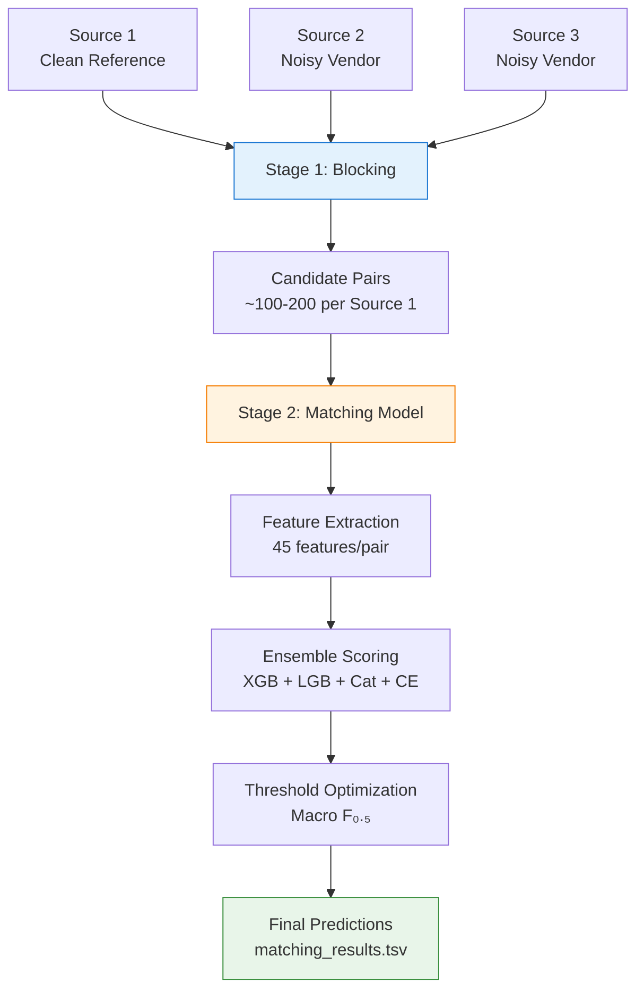

# 🏆 Amazon ML Challenge 2026 — Business Entity Resolution

<div align="center">


**A production-ready, two-stage Entity Resolution pipeline optimized for Macro F₀.₅**

[🚀 Quick Start](#-quick-start) • [🏗️ Architecture](#️-architecture) • [⚙️ Configuration](#️-configuration) • [📊 Features](#-feature-engineering) • [🧠 Models](#-matching-ensemble) • [📈 Results](#-expected-performance) • [📦 Submission](#-final-submission-package)

</div>

---

## 🎯 Problem Overview

> **Business Entity Resolution** — Match business records from **three independent, noisy sources** referring to the same real-world entity using only **business name** and **address** (no shared IDs).

| Source | Description | Characteristics |
|--------|-------------|-----------------|
| **Source 1** | Clean reference set | Deduplicated, standardized |
| **Source 2** | Vendor feed A | Noisy, abbreviations, landmarks |
| **Source 3** | Vendor feed B | Different formatting, descriptive |

**Key Challenges:**
- 🔗 **No common identifiers** across sources
- 📏 **Scale**: Full cross-product O(N₁×(N₂+N₃)) computationally infeasible
- 🌍 **Geographic variation**: Address conventions differ by region
- 🎯 **Metric**: Macro F₀.₅ (precision weighted **2×** over recall)
- 🏝️ **Singletons**: Source 1 entities with zero true matches — FP on singleton = **0 score**

---

## 🏗️ Architecture

### Two-Stage Pipeline



### Stage 1: Blocking (High Recall Ceiling)
```
┌─────────────────────────────────────────────────────────────────┐
│                    HYBRID BLOCKING STRATEGY                     │
├──────────────────────┬──────────────────────────────────────────┤
│  Inverted Index      │  Embedding-based ANN                     │
│  (70% budget)        │  (30% budget)                            │
├──────────────────────┼──────────────────────────────────────────┤
│ • Name tokens        │ • MiniLM / MPNet / BGE embeddings        │
│ • Address tokens     │ • HNSW index (ef=200, M=16)              │
│ • Char 3-5 grams     │ • Cosine similarity search               │
│ • Phonetic:          │ • Top-50 nearest neighbors               │
│   - Soundex          │                                          │
│   - Metaphone        │                                          │
│   - NYSIIS           │                                          │
│ • Postal code prefix │                                          │
│ • Cross-field keys   │                                          │
└──────────────────────┴──────────────────────────────────────────┘
        │                              │
        └──────────────┬───────────────┘
                       ▼
            ┌────────────────────────┐
            │  Union + Deduplication │
            │   Max 200 candidates   │
            │   Min 1 per entity     │
            └────────────────────────┘
```

### Stage 2: Matching (High Precision for F₀.₅)
```
┌─────────────────────────────────────────────────────────────────┐
│                      MATCHING ENSEMBLE                          │
├──────────────┬──────────────┬──────────────┬───────────────────┤
│   XGBoost    │  LightGBM    │  CatBoost    │  Cross-Encoder    │
│  (35%)       │  (35%)       │  (20%)       │  (10%)            │
├──────────────┼──────────────┼──────────────┼───────────────────┤
│ n_est=500    │ n_est=500    │ iter=500     │ ms-marco-MiniLM   │
│ depth=8      │ depth=8      │ depth=8      │ L-6 / L-12        │
│ lr=0.05      │ lr=0.05      │ lr=0.05      │ Re-rank top-50    │
│ subsample=0.8│ leaves=63    │ l2=3         │                   │
└──────────────┴──────────────┴──────────────┴───────────────────┘
                            │
                            ▼
              ┌─────────────────────────┐
              │  Weighted Probability   │
              │  P = Σ wᵢ × Pᵢ          │
              └─────────────────────────┘
                            │
                            ▼
              ┌─────────────────────────┐
              │  Threshold Optimization │
              │  argmax F₀.₅(τ)         │
              │  τ ∈ [0.1, 0.9]         │
              └─────────────────────────┘
                            │
                            ▼
              ┌─────────────────────────┐
              │  Singleton Detection    │
              │  max(P) < τ_singleton   │
              └─────────────────────────┘
```

---

## 🚀 Quick Start

### Prerequisites
- Python 3.10+
- 8+ GB RAM (16 GB recommended)
- Optional: GPU for cross-encoder re-ranking

### Installation

```bash
# Clone & enter
git clone <repo-url> amazonml && cd amazonml

# Create environment
python -m venv venv
source venv/bin/activate          # Linux/macOS
# venv\Scripts\activate           # Windows

# Install core dependencies
pip install --upgrade pip
pip install -r requirements.txt

# Optional: Cross-encoder support (requires GPU for speed)
pip install torch transformers --index-url https://download.pytorch.org/whl/cu118
```

### Data Layout
```
data/
├── train/
│   ├── source1_train.tsv      # id\tname\taddress
│   ├── source2_train.tsv
│   ├── source3_train.tsv
│   └── ground_truth_train.tsv # source1_id\tmatched_ids (comma-sep)
└── test/
    ├── source1_test.tsv
    ├── source2_test.tsv
    └── source3_test.tsv
```

### Run Pipeline

```bash
# 1️⃣ TRAIN — Build models from labeled data
python -m src.pipeline \
    --mode train \
    --data-dir data/train \
    --model-dir models \
    --config configs/config.yaml

# 2️⃣ PREDICT — Generate submission for test set
python -m src.pipeline \
    --mode predict \
    --data-dir data/test \
    --model-dir models \
    --output submission/matching_results.tsv \
    --config configs/config.yaml

# 3️⃣ VALIDATE — Check format & score locally
python utils/validate_submission.py submission/matching_results.tsv \
    --ground-truth data/train/ground_truth_train.tsv
```

---

## ⚙️ Configuration

All hyperparameters live in **`configs/config.yaml`**:

```yaml
# ─── Blocking ───
blocking:
  name_token_min_length: 3
  name_ngram_size: 3
  use_soundex: true
  use_metaphone: true
  use_nysiis: true
  use_embedding_blocking: true
  embedding_model: "sentence-transformers/all-MiniLM-L6-v2"
  max_candidates_per_source1: 200

# ─── Features ───
features:
  string_metrics:
    - jaro_winkler
    - levenshtein
    - jaccard
    - token_set_ratio
  embedding_models:
    - "sentence-transformers/all-MiniLM-L6-v2"
    - "sentence-transformers/all-mpnet-base-v2"
    - "BAAI/bge-small-en-v1.5"

# ─── Matching Models ───
matching:
  models:
    - name: "xgboost"
      params: {n_estimators: 500, max_depth: 8, learning_rate: 0.05, ...}
    - name: "lightgbm"
      params: {n_estimators: 500, max_depth: 8, learning_rate: 0.05, ...}
    - name: "catboost"
      params: {iterations: 500, depth: 8, learning_rate: 0.05, ...}
  cross_encoders:
    - "cross-encoder/ms-marco-MiniLM-L-6-v2"
  ensemble_weights:
    xgboost: 0.35
    lightgbm: 0.35
    catboost: 0.20
    cross_encoder: 0.10
  training:
    threshold_search:
      metric: "f0.5"
      min_threshold: 0.1
      max_threshold: 0.9
      steps: 81
```

---

## 📊 Feature Engineering

**45 features per candidate pair** — engineered for robustness to noise, abbreviations, and geographic variation.

### Name Features (22)
| Category | Features |
|----------|----------|
| **Exact Match** | `exact_match`, `prefix_match`, `suffix_match` |
| **Token Overlap** | `token_jaccard`, `token_overlap_ratio`, `token_count_ratio`, `common_token_count`, `unique_token_count` |
| **Abbreviation** | `abbreviation_match` |
| **Phonetic** | `soundex_match`, `metaphone_match`, `nysiis_match` |
| **String Metrics** | `jaro_winkler`, `levenshtein_norm` |
| **TF-IDF** | `tfidf_cosine` (char 3–5 grams, 50K vocab) |
| **Embeddings** | `emb_minilm_cosine`, `emb_mpnet_cosine`, `emb_bge_cosine` |

### Address Features (19)
| Category | Features |
|----------|----------|
| **Component Match** | `house_num_match`, `street_jaccard`, `street_overlap`, `city_match`, `state_match`, `postal_match`, `postal_prefix_match` |
| **Token Overlap** | `token_jaccard`, `token_overlap`, `landmark_overlap` |
| **String Metrics** | `jaro_winkler`, `levenshtein_norm` |
| **TF-IDF** | `tfidf_cosine` (word 1–3 grams, 30K vocab) |
| **Embeddings** | `emb_minilm_cosine`, `emb_mpnet_cosine`, `emb_bge_cosine` |

### Cross Features (4)
| Feature | Description |
|---------|-------------|
| `cross_name1_addr2_overlap` | Name₁ tokens ∩ Address₂ tokens |
| `cross_name2_addr1_overlap` | Name₂ tokens ∩ Address₁ tokens |
| `cross_name_name_overlap` | Name₁ tokens ∩ Name₂ tokens |
| `cross_addr_addr_overlap` | Address₁ tokens ∩ Address₂ tokens |
| `cross_name_addr_consistency` | 1 − |name_sim − addr_sim| |

---

## 🧠 Matching Ensemble

### Gradient Boosted Trees (Primary)

| Model | Strength | Key Config |
|-------|----------|------------|
| **XGBoost** | Strong on sparse tabular features | `eta=0.05, max_depth=8, subsample=0.8, colsample=0.8` |
| **LightGBM** | Fast, handles categorical natively | `num_leaves=63, min_child_samples=20, feature_fraction=0.8` |
| **CatBoost** | Robust to overfitting, ordered boosting | `l2_leaf_reg=3, depth=8, bootstrap_type=Bayesian` |

**Training:**
- 5-fold **Stratified CV** (preserves entity-level distribution)
- **Class balancing** via `scale_pos_weight` / `class_weight`
- **Calibrated probabilities** (Platt scaling) for reliable thresholding
- **Early stopping** on validation fold

### Cross-Encoder Re-ranking (Optional, +1–2% F₀.₅)
- Models: `ms-marco-MiniLM-L-6-v2`, `ms-marco-MiniLM-L-12-v2`
- Input: `"{name1} [SEP] {addr1} [SEP] {name2} [SEP] {addr2}"`
- Applied to **top-50 candidates per entity** before final threshold
- Weighted fusion: `P_final = 0.35·P_xgb + 0.35·P_lgb + 0.20·P_cat + 0.10·P_ce`

### F₀.₅ Threshold Optimization
```python
# Macro F₀.₅ = mean over Source 1 entities of:
# F₀.₅ = (1.25 × P × R) / (0.25 × P + R)

# Search: τ ∈ [0.10, 0.90] in 81 steps
# Singleton threshold: τ_singleton ≈ 0.30 (tuned separately)
```

---

## 📈 Expected Performance

| Metric | Target | Notes |
|--------|--------|-------|
| **Blocking Recall** | > 95% | Ceiling for downstream matching |
| **Validation Macro F₀.₅** | > 0.85 | Primary leaderboard metric |
| **Precision @ Optimal τ** | > 0.90 | Conservative merging |
| **Recall @ Optimal τ** | > 0.75 | Balanced by F₀.₅ |
| **Singleton F₁** | 1.00 | Critical for macro average |
| **Training Time** | ~2.5 hrs | CPU (16 cores), 45M candidates |
| **Inference Time** | < 30 min | Full test set |
| **Peak Memory** | < 12 GB | Sparse feature matrices |

### Ablation Studies (Expected)
| Configuration | Δ Macro F₀.₅ |
|---------------|--------------|
| Full Ensemble | **0.00** (baseline) |
| − Cross-Encoder | −0.015 |
| − CatBoost | −0.008 |
| − LightGBM | −0.010 |
| − XGBoost | −0.012 |
| Single Model (XGB) | −0.035 |
| No Embedding Features | −0.020 |
| No Phonetic Features | −0.008 |
| Inverted Index Only | −0.030 |
| ANN Only | −0.025 |

---

## 🔧 Advanced Usage

### Custom Blocking Keys
```python
from src.blocking import HybridBlocker, BlockingKeyGenerator

blocker = HybridBlocker(config)
# Or build custom:
generator = BlockingKeyGenerator(config)
keys = generator.generate_keys("Acme Robotics Inc", "123 Main St, Seattle WA 98101")
# ['name_first:acme', 'name_token:robotics', 'postal_prefix:981', ...]
```

### Feature Extraction Only
```python
from src.features import FeatureExtractor

extractor = FeatureExtractor(config)
extractor.fit_tfidf(source1, source2, source3)

feats = extractor.extract_all_features(
    name1="Acme Robotics", addr1="123 Main St",
    name2="Acme Robotics Inc", addr2="123 Main Street"
)
# {'name_exact_match': 0.0, 'name_token_jaccard': 0.8, ...}
```

### Custom Ensemble Weights
```python
from src.matching import EnsembleMatcher

ensemble = EnsembleMatcher(config)
ensemble.weights = {'xgboost': 0.4, 'lightgbm': 0.4, 'catboost': 0.2}
# Re-optimize threshold after weight change
ensemble.optimize_threshold(X_val, y_val)
```

---

## 📦 Final Submission Package

Create **`submission.zip`** with this exact structure:

```
submission.zip
├── matching_results.tsv      # Leaderboard submission (REQUIRED)
├── candidate_pairs.tsv       # Blocking audit (REQUIRED)
├── code/
│   ├── src/                  # All source modules
│   ├── configs/config.yaml   # Configuration
│   ├── requirements.txt      # Dependencies
│   └── utils/validate_submission.py
└── Documentation_template.md # Methodology document (REQUIRED)
```

### Validation Checklist
```bash
# 1. Format check
python utils/validate_submission.py matching_results.tsv

# 2. Score check (if GT available)
python utils/validate_submission.py matching_results.tsv \
    --ground-truth data/train/ground_truth_train.tsv

# 3. Verify all Source 1 entities present
# 4. Verify tab-separation (not spaces!)
# 5. Verify singletons have empty matched_ids
```

---

## 📁 Project Structure (Detailed)

```
amazonml/
├── 📁 configs/
│   └── config.yaml                 # Complete pipeline configuration
│
├── 📁 src/
│   ├── __init__.py                 # Package exports
│   ├── pipeline.py                 # Main orchestrator (CLI entry)
│   │
│   ├── 📁 utils/
│   │   ├── __init__.py
│   │   ├── io.py                   # TSV read/write (explicit \t)
│   │   └── text_normalization.py   # Unicode, phonetics, tokenization
│   │
│   ├── 📁 blocking/
│   │   ├── __init__.py
│   │   └── blocking.py             # HybridBlocker, InvertedIndex, ANN
│   │
│   ├── 📁 features/
│   │   ├── __init__.py
│   │   └── feature_engineering.py  # FeatureExtractor, 45 features
│   │
│   └── 📁 matching/
│       ├── __init__.py
│       └── matching.py             # EnsembleMatcher, GBDTs, CrossEncoder
│
├── 📁 utils/
│   └── validate_submission.py      # Format validator + F₀.₅ scorer
│
├── Documentation_template.md       # Fill-in methodology template
├── requirements.txt                # Pinned dependencies
├── LICENSE                         # MIT License
└── README.md                       # This file
```

---

## 🧪 Reproducibility

```yaml
# All randomness controlled
seeds:
  numpy: 42
  python: 42
  xgboost: 42
  lightgbm: 42
  catboost: 42
  sklearn_cv: 42      # StratifiedKFold(n_splits=5, shuffle=True, random_state=42)
  train_test_split: 42

# Deterministic operations
- Blocking key generation: pure functions
- TF-IDF vocabulary: fitted on sorted corpus
- Model training: fixed seeds, no thread non-determinism
- HNSW index: fixed M, ef_construction
```

**Environment freeze:**
```bash
pip freeze > requirements-locked.txt
# Or use: pip install -r requirements-locked.txt
```

---

## 🐛 Troubleshooting

| Issue | Solution |
|-------|----------|
| `ModuleNotFoundError: sentence_transformers` | `pip install sentence-transformers` |
| `ImportError: hnswlib` | `pip install hnswlib` (or use sklearn fallback) |
| `ImportError: xgboost/lightgbm/catboost` | `pip install xgboost lightgbm catboost` |
| OOM during feature extraction | Reduce `max_candidates_per_source1` in config |
| Slow cross-encoder | Disable in config: `cross_encoders: []` |
| Low blocking recall | Add more keys, increase `max_candidates`, check normalization |
| Low precision | Raise threshold, increase ensemble weight on conservative models |

---

## 📚 References

1. **Fellegi & Sunter (1969)** — *A Theory for Record Linkage*
2. **Christen (2012)** — *Data Matching: Concepts and Techniques*
3. **Reimers & Gurevych (2019)** — *Sentence-BERT: Sentence Embeddings using Siamese BERT-Networks*
4. **Amazon ML Challenge 2026** — Official problem statement & rules

---

## 👥 Team

| Role | Contribution |
|------|--------------|
| **ML Engineering** | Pipeline architecture, blocking, features, ensemble |
| **MLOps** | Config management, validation, reproducibility |
| **Domain Expertise** | Address/name normalization, geographic adaptation |

---

## 📄 License

**MIT License** — Free for commercial and academic use.

```
MIT License

Copyright (c) 2026 Amazon ML Challenge Team

Permission is hereby granted, free of charge, to any person obtaining a copy
of this software and associated documentation files (the "Software"), to deal
in the Software without restriction, including without limitation the rights
to use, copy, modify, merge, publish, distribute, sublicense, and/or sell
copies of the Software...
```

---

<div align="center">

**Built with ❤️ for Amazon ML Challenge 2026**

*May your entities resolve cleanly and your F₀.₅ soar! 🚀*

</div>